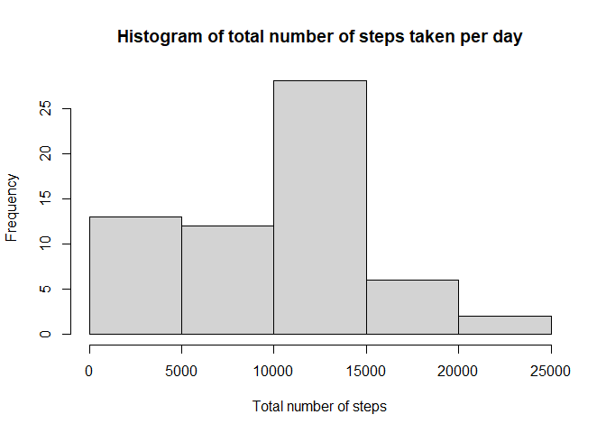
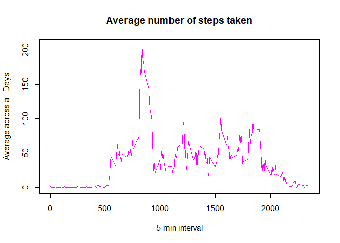
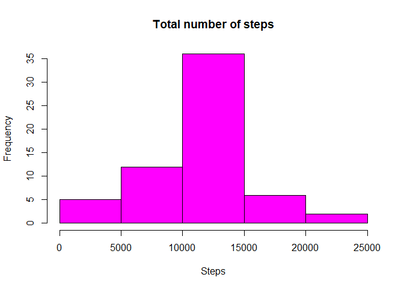
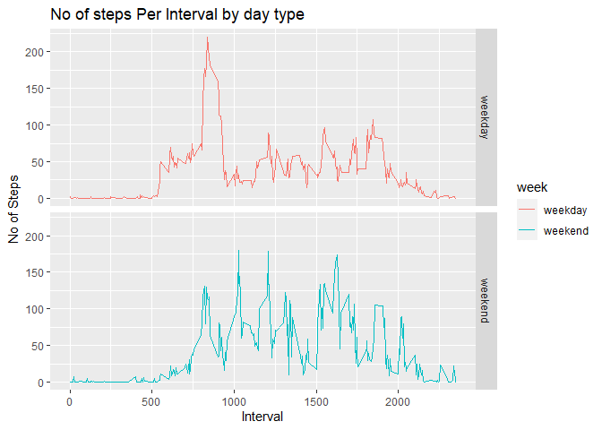

## Loading and preprocessing the data


```r
library(rio)
base <- import("activity.csv")
```

## What is mean total number of steps taken per day?


```r
total_num_steps <- with(base, tapply(steps, as.factor(base$date), sum, na.rm = T))


hist(total_num_steps, main = "Histogram of total number of steps taken per day", xlab = "Total number of steps")
```

<!-- -->

```r
summary(total_num_steps)
```

```
##    Min. 1st Qu.  Median    Mean 3rd Qu.    Max. 
##       0    6778   10395    9354   12811   21194
```

## What is the average daily activity pattern?


```r
mean_steps <- with(base, tapply(steps, interval, mean, na.rm = T))


plot(row.names(mean_steps), mean_steps, type = "l", xlab = "5-min interval", 
     ylab = "Average across all Days", main = "Average number of steps taken", 
     col = "magenta")
```

<!-- -->

```r
max_interval <- which.max(mean_steps)
names(max_interval)
```

```
## [1] "835"
```

## Imputing missing values


```r
missing <- sum(is.na(base))
missing
```

```
## [1] 2304
```

```r
StepsAverage <- aggregate(steps ~ interval, data = base, FUN = mean)

complete <- base # dataset called complete

for (i in StepsAverage$interval) {
  complete[complete$interval == i & is.na(complete$steps), ]$steps <- 
    StepsAverage$steps[StepsAverage$interval == i]
}

sum(is.na(complete))
```

```
## [1] 0
```

```r
steps_complete <- with(complete, tapply(steps, as.factor(date), sum, rm.na = T))


hist(steps_complete, main = "Total number of steps", xlab = "Steps", col = "magenta")
```

<!-- -->

```r
summary(steps_complete)
```

```
##    Min. 1st Qu.  Median    Mean 3rd Qu.    Max. 
##      42    9820   10767   10767   12812   21195
```

## Are there differences in activity patterns between weekdays and weekends?


```r
complete$day <- weekdays(complete$date)
complete$week <- ""
complete[complete$day == "sabado" | complete$day == "domingo", ]$week <- "weekend"
complete[!(complete$day == "sabado" | complete$day == "domingo"), ]$week <- "weekday"
complete$week <- factor(complete$week)

#load the ggplot library
library(ggplot2)
```

```
## Warning: replacing previous import 'vctrs::data_frame' by 'tibble::data_frame'
## when loading 'dplyr'
```

```r
# Create the aggregated data frame by intervals and day type

steps_per_day <- aggregate(steps ~ interval+ week, complete, mean)

# Create the plot
graf <- ggplot(steps_per_day, aes(interval, steps)) +
  geom_line(stat = "identity", aes(colour = week)) +
  theme_gray() +
  facet_grid(week ~ ., scales="fixed", space="fixed") +
  labs(x="Interval", y=expression("No of Steps")) +
  ggtitle("No of steps Per Interval by day type")

print(graf)
```

<!-- -->
